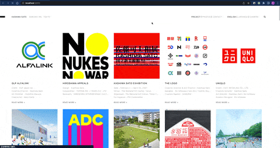

This is a [Next.js](https://nextjs.org/) project bootstrapped with [`create-next-app`](https://github.com/vercel/next.js/tree/canary/packages/create-next-app).

Mock https://kashiwasato.com/ project

## Env

```
node v14.17.6.
npm 6.14.15
```

## Init

```
# clone project
git clone git@github.com:xiguan00yu/mock-kashiwasato.git

cd mock-kashiwasato

# install deps
npm i


# run
npm run dev

```

## Preview

### static image 


### full gif



### mobile gif
